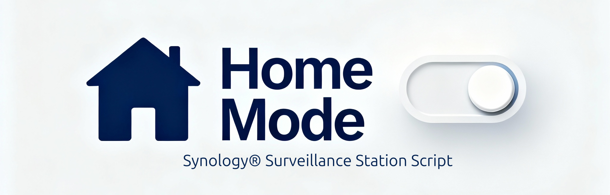

# Homemode Switcher for Synology Surveillance Station

Bash + Python hybrid script to automatically toggle **Home Mode** in Synology Surveillance Station, based on the presence of authorized devices detected via your **FritzBox router**.



This project is an enhanced, **FritzBox-integrated Bash fork** of  
[dtypo/Home-Mode-Switcher-for-Synology-Surveillance-Station](https://github.com/dtypo/Home-Mode-Switcher-for-Synology-Surveillance-Station).

Unlike the original version, this script:

- 💡 Uses your **FritzBox API** to reliably detect active devices in your Wi-Fi (even iPhones!)
- 🔒 Keeps **Synology Home Mode** fully in sync with the router state
- 🧩 Includes a **local fallback** scan for when the FritzBox is unreachable
- ⚙️ Runs directly on your NAS — lightweight, automatic, and update-safe

---

## ✨ Features

- ✅ Reliable detection of active devices directly via **FritzBox API**
- ✅ Works very well with **iPhones** (even with Private Wi-Fi MACs)
- ✅ Automatically toggles **Home Mode** in Synology Surveillance Station
- ✅ Compares desired vs. current state → avoids redundant notifications
- ✅ Lightweight Bash + Python hybrid — runs locally on your NAS
- ✅ Optional **Nighttime Mode** to force disarming during defined hours
- ✅ Easy integration with DSM **Task Scheduler**

---

## 🧩 Requirements

- **Synology NAS** with **DSM 7.x**
- **Surveillance Station** installed and configured
- **FritzBox router** with local TR-064 API enabled (default on most models)
- **Python 3.8–3.11** available on the NAS
- A **local Python virtual environment (venv)** with:
  - [`fritzconnection`](https://pypi.org/project/fritzconnection/)
  - [`requests`](https://pypi.org/project/requests/)

> ℹ️ You do **not** need to open ports to the internet. Everything works over your local network.

---

## ⚙️ Installation

### 1) Create a minimal SS user (recommended)

In **Surveillance Station → User → Add**, create:
- **User**: `HomeModeSwitcher`
- **Permission**: allow only **“Switch Home Mode manually.”**
- Disable other SS privileges.

### 2) Download the project

```bash
mkdir -p /volume1/pathto/homemode_switcher2
cd /volume1/pathto/homemode_switcher2
# Download your script here, e.g.:
# wget wget https://raw.githubusercontent.com/chriswa81/Home-Mode-Switcher2-for-Synology-Surveillance-Station/main/homemode_switcher2.sh
chmod +x homemode_switcher2.sh
```

### 3) Create a Python virtual environment (update-safe)

This step isolates dependencies from the Synology system and ensures the setup remains functional after DSM updates.

```bash
cd /volume1/pathto/homemode_switcher2
python3 -m venv venv
source venv/bin/activate
pip install fritzconnection requests
deactivate
```

💡 Why use venv?
Synology DSM updates can overwrite or remove global Python packages.
Keeping the FritzBox dependencies in a local venv folder ensures:

- The script remains self-contained and update-safe
- No system-level Python changes are required
- Easy cleanup (just delete the folder to remove dependencies)

### 4) Configure the script

Edit the top section of ```homemode_switcher2.sh``` with your own values:
```bash
SYNO_USER="HomeModeSwitcher"
SYNO_PASS="yourpassword"
SYNO_URL="192.168.xx.xx:5000"

FRITZ_IP="192.168.xx.1"
FRITZ_USER="homemodeswitcher"
FRITZ_PASS="yourfritzboxpassword"
```

You will pass the authorized MAC addresses as script arguments.

### 5) Run test manually
```bash
bash /volume1/pathto/homemode_switcher2/homemode_switcher2.sh AA:BB:CC:11:22:33 DD:EE:FF:44:55:66
```

Expected output:
```bash
Executed at: ...
Gefundene MAC-Adressen im Netzwerk:
  -> Treffer mit autorisierter MAC: AA:BB:CC:11:22:33
Treffer insgesamt: 1
Homemode aktiviert
```

### 6) Schedule automatic execution

Use **DSM** → **Task Scheduler** → **Create** → **Scheduled Task** → **User-defined script**:
```bash
/bin/bash /volume1/pathto/homemode_switcher2/homemode_switcher2.sh AA:BB:CC:11:22:33 DD:EE:FF:44:55:66
```

- Run as ```root``` (or a user with required privileges)
- Set interval: every 1–5 minutes (as preferred)
- Optionally enable email notifications on failure

### 7) Verify in Surveillance Station

After the script executes:

- Open Surveillance Station → Home Mode
- Confirm that Home Mode is toggled automatically based on device presence.

---

## 🧠 How it works

1. The script authenticates to your **FritzBox** using fritzconnection.
2. It reads the list of **active devices** (MAC + hostname + status).
3. If any **authorized MAC** is currently active → desired state = **Home Mode ON**.
Otherwise → desired state = **OFF** 

4. It fetches the current Home Mode from Surveillance Station and compares:
  - If desired ≠ current → it toggles Home Mode via the Synology Web API.
  - If desired = current → it does **nothing** (no duplicate notification).
5. It writes a small cache to /tmp/homemode_state to keep track of the last decision.


If the FritzBox query fails, the script falls back to a **local ARP scan** to still provide best effort detection.

---

## 📡 Why FritzBox API?

```fritzconnection``` uses the same local API (TR-064) that Fritz!OS itself provides.
Compared to pure ARP/ping approaches, this has key advantages:

- Real-time device status from the router’s perspective (no stale ARP caches)
- Very **reliable with iPhones**, even when Wi-Fi sleeps or when Private Wi-Fi Address is enabled
- No need for ```nmap``` or SynoCli — fewer moving parts
- Purely local communication, no internet access required

---

## 🌙 Nighttime Mode (Optional)

The helper ```is_nighttime()``` can force **Home Mode ON** during certain hours:
```bash
function is_nighttime() {
    current_time=$(date "+%H%M")
    # Example: 23:00–06:00
    if [ "$current_time" -ge "2300" ] || [ "$current_time" -lt "0600" ]; then
        return 0
    else
        return 1
    fi
}
```


To disable the feature entirely:

```bash
is_nighttime() { return 1; }
```

---

## ⚖️ Dependencies

All Python dependencies live in the local ```venv``` inside the project folder:

- [```fritzconnection```](https://pypi.org/project/fritzconnection/)
- [```requests```](https://pypi.org/project/requests/)

No global packages are modified → **update-safe** across DSM upgrades.

---

## 🔍 Troubleshooting

- FritzBox login fails

  - Check ```FRITZ_IP```, ```FRITZ_USER```, ```FRITZ_PASS```
  - Ensure local TR-064 is enabled (default for most FritzBox models)
  - Test manually:
  ```bash
  /volume1/pathto/homemode_switcher2/venv/bin/python3 -c "from fritzconnection.lib.fritzhosts import FritzHosts; print(FritzHosts(address='192.168.xx.1', user='USER', password='PASS').get_hosts_info()[:1])"```

- No devices found
  - Ensure NAS and FritzBox are in the same subnet
  - Make sure devices connect via the FritzBox or its repeaters/mesh

- Home Mode doesn’t change
  - Verify the **Surveillance Station** user can switch Home Mode
  - Check ```SYNO_URL``` (port 5000/5001)
  - Script only toggles when desired ≠ current (by design)

---

## 💡 Best Practices

- Run every 1–2 minutes for near real-time behavior
- Keep the ```venv``` next to your script — avoids system Python changes
- For iPhones, disabling “Private Wi-Fi Address” can improve consistency (optional)

---

## 🧠 Technical Notes

- Synology Web API endpoint: ```SYNO.SurveillanceStation.HomeMode```
- FritzBox data via ```fritzconnection.lib.fritzhosts.FritzHosts()```
- Local cache: ```/tmp/homemode_state``` (stores ```true/false```)
- Avoids redundant SS notifications by comparing desired vs. actual state
- Fallback to ```/proc/net/arp``` scanning if FritzBox API is temporarily unavailable

---

## 🪪 License

MIT License

Copyright (c) 2025, chriswa81

Permission is hereby granted, free of charge, to any person obtaining a copy
of this software and associated documentation files (the "Software"), to deal
in the Software without restriction, including without limitation the rights
to use, copy, modify, merge, publish, distribute, sublicense, and/or sell
copies of the Software, and to permit persons to whom the Software is
furnished to do so, subject to the following conditions:

The above copyright notice and this permission notice shall be included
in all copies or substantial portions of the Software.

THE SOFTWARE IS PROVIDED "AS IS", WITHOUT WARRANTY OF ANY KIND,
EXPRESS OR IMPLIED, INCLUDING BUT NOT LIMITED TO THE WARRANTIES OF
MERCHANTABILITY, FITNESS FOR A PARTICULAR PURPOSE AND NONINFRINGEMENT.


Credit and inspiration:
[Home-Mode-Switcher-for-Synology-Surveillance-Station by dtypo](https://github.com/dtypo/Home-Mode-Switcher-for-Synology-Surveillance-Station)

---

## 🤝 Contributions

Contributions are welcome!
Please open issues or pull requests for bug fixes, improvements, or new features.


